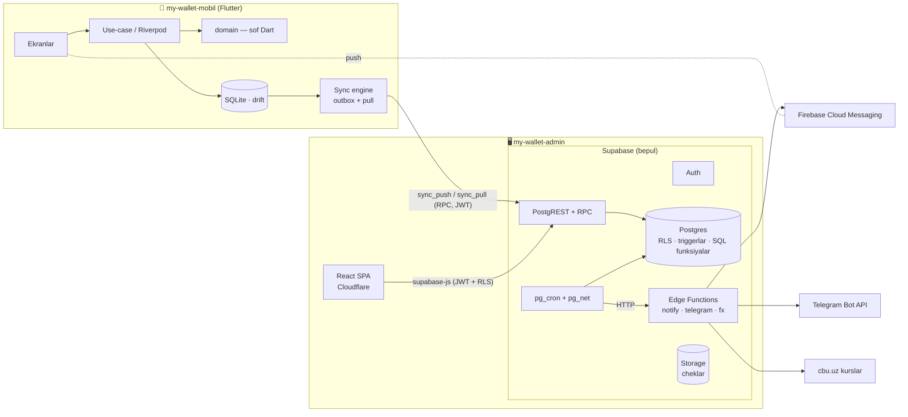
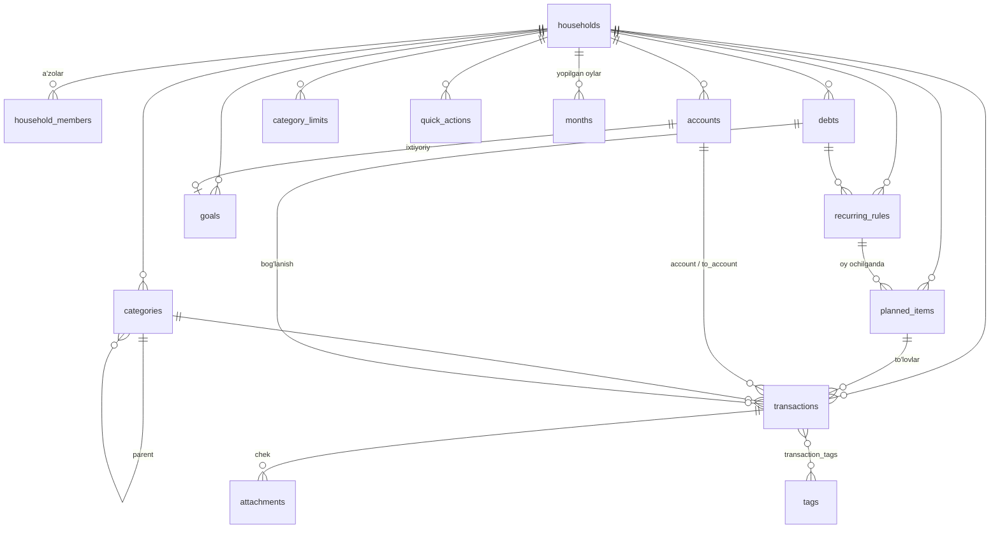

# My Wallet — arxitektura

> Biznes qoidalar: [`BIZNES-QOIDALAR.md`](BIZNES-QOIDALAR.md) (BR-xxx).
> Reja: [`PLAN.md`](PLAN.md). Deploy: [`DEPLOY.md`](DEPLOY.md).
> Mobil ilovaning ichki arxitekturasi: `my-wallet-mobil/docs/ARXITEKTURA.md`.

---

## 1. Umumiy ko'rinish



| Qism | Repo | Texnologiya | Hosting (bepul) |
|---|---|---|---|
| Ma'lumotlar bazasi, API, auth, rejali ishlar | `my-wallet-admin/supabase` | Supabase: Postgres 17, PostgREST, GoTrue, pg_cron, pg_net, Edge Functions (Deno), Storage | Supabase Free (2 loyiha: staging + prod) |
| Admin panel | `my-wallet-admin/web` | React 19 + Vite + TypeScript SPA | Cloudflare Workers Static Assets |
| Mobil ilova | `my-wallet-mobil` | Flutter (Android asosiy, iOS kodda tayyor) | Firebase App Distribution + GitHub Releases |
| Push | — | Firebase Cloud Messaging | Firebase Spark (bepul) |
| CI/CD, zaxira, keep-alive | ikkala repo | GitHub Actions | GitHub Free |

---

## 2. Arxitektura qarorlari (ADR)

Har qaror: **nima**, **nega**, **nimadan voz kechildi**, **narxi**.

### ADR-01 · Backend = Supabase (Postgres markazli)

- **Nega:** moliya — relyatsion domen (tranzaksiya, cheklov, agregat, hisobot).
  Postgres: ACID, `CHECK`/FK, indeksli `GROUP BY`, RLS bilan izolyatsiya.
  Supabase bepul rejada auth (50k MAU), 500 MB DB, Edge Functions (500k/oy),
  pg_cron, Storage (1 GB) beradi — **karta talab qilmaydi**.
- **Voz kechildi:**
  - *Firebase/Firestore* — hujjat bo'yicha to'lov har hisobot uchun
    delta-agregat, reconciler va ikki tilda parite testlarini talab qildi;
    Cloud Functions uchun Blaze (karta) kerak — "bepul" talabiga zid.
  - *Cloudflare Workers + D1* — auth va RLS yo'q, hammasini qo'lda yozish kerak.
  - *O'z serveri (NestJS/Laravel) + VPS* — bepul doimiy hosting yo'q (Render
    uxlaydi, Fly.io karta so'raydi), ops yuki.
- **Narxi / xavf:** bepul loyiha **7 kun faolsizlikda pauza** qilinadi →
  GitHub Actions keep-alive (ADR-13). Bepul rejada **zaxira yo'q** → o'z
  zaxiramiz (ADR-12). DB 500 MB → monitoring (platforma sahifasi).

### ADR-02 · Biznes qoidalarning yagona manbai — ma'lumotlar bazasi

- Yaxlitlik (cheklovlar, FK), avtomatik maydonlar (`budget_month`,
  `amount_base`, reja holati, ajratma rejasi) **triggerlarda**; ko'p qadamli
  ishlar (oyni ochish, ommaviy to'lash, qayta joylash) **SQL funksiyalarda**
  (RPC). Admin ham, mobil ham, cron ham shu qatlamdan o'tadi — qaysi yo'l
  bilan yozilmasin, qoida bir xil.
- Mobil ilova offline ishlashi uchun faqat **ko'rsatish hisoblarini**
  (oylik yakun, prognoz, holat, tegishli oy taxmini) Dart'da takrorlaydi.
  Parite **umumiy golden fixture'lar** bilan kafolatlanadi (`contracts/`).
  Server — hakam: sinxronda kanonik qiymatlarni qaytaradi.

### ADR-03 · Agregatlar o'qish paytida hisoblanadi (saqlanmaydi)

- Oy hisobotlari indeksli diapazonda `SUM ... GROUP BY` bilan olinadi:
  10 yillik oilaviy byudjet ≈ 25 000 amal — bir oy ≈ 200 qator, millisekundlar.
  Covering index (`INCLUDE`) bilan jadvalning o'ziga murojaat ham bo'lmaydi.
- **Natija:** drift yo'q → reconciler, delta-mantiq va uning property
  testlari kerak emas (eski tizimning eng murakkab qismi yo'qoladi).
- **Qachon qayta ko'rib chiqiladi:** `report_month` p95 > 150 ms bo'lsa —
  `month_summaries` materializatsiyasi (trigger bilan) qo'shiladi. O'lchov:
  E09 dagi `EXPLAIN ANALYZE` testi.

### ADR-04 · Ko'p ijarachilik (household) birinchi kundan

- Hamma biznes jadvalda `household_id`; RLS a'zolik orqali. Shaxsiy
  foydalanish = bitta a'zoli byudjet. Oilaviy rejim keyin **sxemani
  o'zgartirmasdan** yoqiladi.

### ADR-05 · Hisoblar + o'tkazmalar; shaxsiy fond — maxsus hisob

- "Karta/naqd" usuli → haqiqiy hisoblar (BR-020). O'tkazma byudjetga ta'sir
  qilmaydi; **yagona istisno** — `personal_fund` hisobiga o'tkazma = "O'zim
  uchun" xarajati (BR-061). Eski arifmetika (qoldiq, orttirgan, fond) aynan
  saqlanadi, pul joylashuvi esa ko'rinadigan bo'ladi.

### ADR-06 · Reja va fakt alohida jadvallarda

- `planned_items` (kutilayotgan) va `transactions` (haqiqiy). Qisman to'lov,
  to'langan sana, boshqa hisobdan to'lash mumkin bo'ladi (BR-052).
  Reja holati: `paid_amount` trigger bilan yangilanadi; `overdue`/`pending`
  o'qishda bugungi sanadan hisoblanadi (kunlik "status sweep" kerak emas).

### ADR-07 · ID lar — UUIDv7, klientda yaratiladi

- Offline yaratilgan yozuv sinxronda takrorlanmaydi (idempotent upsert).
  v7 vaqt bo'yicha tartiblangan → B-tree indeks lokalligi yaxshi.

### ADR-08 · Pul = `bigint` eng kichik birlikda + valyuta

- `amount` (hisob valyutasida), `amount_base` (asosiy valyutada, amal
  sanasidagi kurs bilan yozuv paytida muzlatiladi). Hisobotlar `amount_base`
  ni yig'adi — o'qishda kurs jadvaliga JOIN yo'q.

### ADR-09 · Mobil = offline-first (SQLite + outbox + versiyali pull)

- Yozuv avval lokal bazaga + `outbox` ga; UI darhol yangilanadi; fon
  sinxron `sync_push` (paket, idempotent) va `sync_pull` (kursor) orqali.
  Batafsil: 6-bo'lim.

### ADR-10 · Admin = SPA, server yo'q

- Admin panel statik SPA: to'g'ridan-to'g'ri Supabase'ga foydalanuvchi JWT'si
  bilan (RLS himoyalaydi). Imtiyozli amallar (foydalanuvchilar ro'yxati,
  e'lon yuborish) — JWT va rolni tekshiruvchi Edge Function orqali.
  `secret` kalit **hech qachon** brauzerga tushmaydi.
- Cloudflare statik so'rovlar uchun cheksiz va bepul; tijoriy foydalanishga
  ruxsat. (*Vercel Hobby* — faqat notijoriy; Next.js SSR bu yerda foyda
  bermaydi.)

### ADR-11 · Bildirishnomalar: outbox + Edge Function

- SQL **nimani** yuborishni hal qiladi (set-based, pgTAP bilan testlanadi) va
  `notification_outbox` ga yozadi; Edge Function **qanday** yetkazishni
  (FCM / Telegram / email) bajaradi. Dedup kaliti — ikki marta yuborilmaydi.

### ADR-12 · Zaxira nusxa — o'zimiz

- Har kecha GitHub Actions: `pg_dump` (pooler orqali) → gzip → `age` bilan
  shifrlash → artefakt (90 kun). Haftada bir marta tiklash mashqi.
- Repo public bo'lgani uchun artefaktni istalgan odam yuklab olishi mumkin —
  shuning uchun shifrlash **majburiy**, yopiq kalit faqat egasida.

### ADR-13 · Keep-alive

- GitHub Actions har 2 kunda staging va prod'ning `health` RPC'sini chaqiradi
  (haqiqiy API so'rovi — pauzaga qarshi) va javob vaqtini tekshiradi;
  xato bo'lsa Telegram'ga ogohlantirish.
- Repolar **public** (2026-09-18 da tekshirildi): GitHub 60 kun commit
  bo'lmasa rejali workflow'larni o'chiradi → `keepalive` qadami workflow'ni
  API orqali qayta faollashtiradi (commit qilmasdan, `actions: write`).
- Public repo afzalligi: Actions minutlari cheksiz, Environments va branch
  himoyasi bepul. Xavfi: workflow loglari va artefaktlar hammaga ko'rinadi →
  loglarga ma'lumot chiqarilmaydi, zaxira faqat shifrlangan (ADR-12).

### ADR-14 · Ikki repo va ular orasidagi shartnoma

- `my-wallet-admin` — backend + admin (shartnoma egasi).
  `my-wallet-mobil` — Flutter ilova.
- Shartnoma to'plami `contracts/` (admin repoda yaratiladi, mobil repoga
  pinned versiya bilan ko'chiriladi):
  `BIZNES-QOIDALAR.md`, `api.md` (RPC imzolari va payloadlar),
  `fixtures/*.json` (golden holatlar), `schema-version`.
  Mobil CI: `contracts.lock` dagi commit bilan solishtiradi, eskirgan bo'lsa
  qulaydi; integratsiya testlari o'sha commitdagi backendni Docker'da ko'taradi.

### ADR-15 · Lokalizatsiya

- UI: o'zbek (lotin) asosiy, rus, ingliz. Mobil — ARB (`gen-l10n`), admin —
  i18next JSON. Tizim kategoriyalari shablonlari 3 tilda.

---

## 3. Ma'lumotlar modeli

### 3.1. ERD (asosiy jadvallar)



### 3.2. Jadvallar (qisqa sxema)

Barcha biznes jadvallarida umumiy ustunlar: `id uuid` (v7),
`household_id uuid`, `created_at`, `updated_at`, `created_by`,
`deleted_at` (soft delete — sinxron uchun), `row_version bigint` (sinxron
kursori, 6-bo'lim).

- Byudjet ichidagi havolalar — **kompozit FK** `(household_id, x_id) →
  (household_id, id)`: boshqa byudjet yozuviga havola tuzilishi jihatidan
  imkonsiz, FK tekshiruvi `household_id` bilan boshlanadigan indeksni ishlatadi.
- Takrorlanadigan qoidalar — domenlar: `entity_name` (1–60, trim, BR-003),
  `icon_key`, `hex_color`, `month_start` (oyning 1-kuni).
- Klientda `DELETE` huquqi yo'q — o'chirish `deleted_at` bilan (tombstone
  sinxronga yetadi); yozuv huquqi ustunlar bo'yicha (`grant insert/update (…)`).

| Jadval | Asosiy ustunlar | Cheklovlar / izoh |
|---|---|---|
| `profiles` | `user_id` PK→auth.users, `display_name`, `locale`, `last_household_id` | |
| `households` | `name`, `base_currency char(3)`, `timezone`, `personal_fund_mode` (`percent`/`fixed`), `personal_fund_value bigint`, `personal_fund_day smallint`, `personal_fund_source_account_id`, `auto_open_month bool`, `strict_month_lock bool` | BR-060 |
| `household_members` | PK(`household_id`,`user_id`), `role` (`owner`/`admin`/`member`/`viewer`) | BR-011 |
| `household_invites` | `code` (8 belgi, unique), `role`, `expires_at`, `accepted_by`, `accepted_at` | BR-012 |
| `accounts` | `name`, `type`, `currency`, `opening_balance bigint`, `opening_date`, `icon`, `color`, `sort_order`, `archived_at` | unique(household, lower(name)); bitta `personal_fund` (partial unique) |
| `categories` | `kind` (`income`/`expense`), `name`, `parent_id`, `month_shift smallint` (−1..1, faqat income), `system_code`, `icon`, `color`, `sort_order`, `archived_at` | unique(household, kind, lower(name)); parentning parenti yo'q (1 daraja) |
| `recurring_rules` | `kind` (`expense`/`income`/`allocation`), `name`, `category_id`, `account_id`, `amount bigint null`, `day_of_month`, `auto_pay`, `active`, `debt_id`, `start_month`, `end_month`, `sort_order` | BR-080 |
| `planned_items` | `kind`, `name`, `category_id`, `account_id`, `planned_amount bigint null` (asosiy valyutada), `due_date`, `budget_month date`, `auto_pay`, `debt_id`, `recurring_rule_id`, `system_code`, `paid_amount bigint` (trigger), `settled_at` (trigger), `closed_at` (qo'lda yopish), `skipped_at`, `note` | unique(`recurring_rule_id`,`budget_month`); unique(household, budget_month, system_code); fond hisobi rejada yo'q |
| `transactions` | `kind` (`income`/`expense`/`transfer`), `account_id`, `to_account_id`, `amount bigint >0` (hisob valyutasida — valyuta ustuni yo'q, BR-026), `to_amount`, `amount_base`, `fx_rate`, `category_id`, `payee`, `occurred_on date`, `budget_month date`, `budget_month_source` (`auto`/`manual`), `planned_item_id`, `debt_id`, `note`, `source` (`manual`/`quick_action`/`auto_pay`/`import`/`telegram`) | kind'ga mos CHECK'lar (transfer ⇒ to_account, category yo'q); fondga daromad yo'q |
| `debts` | `name`, `direction`, `total`, `paid_before`, `monthly_payment`, `currency`, `due_date`, `note`, `archived_at` | BR-110 |
| `goals` | `name`, `target`, `saved_manual`, `monthly_contribution null`, `deadline`, `account_id null`, `sort_order`, `achieved_at` | BR-120, BR-122 |
| `category_limits` | `category_id`, `amount`, `alert_80`, `alert_100` | unique(household, category) |
| `quick_actions` | `name`, `amount`, `category_id`, `account_id`, `payee`, `sort_order` | |
| `months` | PK(`household_id`,`month`), `opened_at`, `closed_at`, `closed_by` | BR-150 |
| `tags`, `transaction_tags` | | BR-200 |
| `attachments` | `transaction_id`, `storage_path`, `mime`, `size_bytes` | BR-201 |
| `notification_prefs` | PK(`user_id`,`household_id`), `push`, `telegram`, `email`, `reminder_hour`, `days_ahead`, `monthly_report`, `report_day`, `limit_alerts` | BR-160.. |
| `device_tokens` | `user_id`, `token`, `platform`, `app_version`, `last_seen_at` | |
| `telegram_links` | `user_id` PK, `chat_id`, `linked_at` + `telegram_link_tokens` | BR-163 |
| `notification_outbox` | `user_id`, `household_id`, `type`, `payload jsonb`, `dedupe_key` unique, `status`, `attempts`, `sent_at`, `error` | ADR-11 |
| `monthly_reports` | PK(`household_id`,`month`), `payload jsonb`, `generated_at` | BR-167 |
| `audit_log` | `bigserial`, `household_id`, `actor_id`, `table_name`, `record_id`, `action`, `old`, `new`, `at` | BR-008, 180 kun |
| `sync_mutations` | PK `mutation_id`, `household_id`, `result jsonb`, `applied_at` | idempotentlik, 30 kun |
| **Tizim** `currencies` | `code`, `name_i18n`, `symbol`, `exponent`, `active` | super-admin |
| **Tizim** `exchange_rates` | PK(`currency`,`rate_date`), `rate_to_base numeric(18,6)`, `source` | CBU |
| **Tizim** `category_templates` | `kind`, `name_i18n jsonb`, `icon`, `color`, `month_shift`, `system_code`, `sort_order` | onboarding |
| **Tizim** `app_config` | `key` PK, `value jsonb` | min versiya, e'lon, flaglar |
| **Tizim** `platform_admins` | `user_id` PK | BR-213 |
| **Tizim** `job_runs` | `job`, `started_at`, `finished_at`, `status`, `details jsonb` | |

### 3.3. Triggerlar (yozuv paytidagi qoidalar)

| Trigger | Jadval | Nima qiladi | Qoida |
|---|---|---|---|
| `set_row_version` (BEFORE) | barcha sinxron jadvallar | household advisory lock → `nextval` → `row_version`, `updated_at` | ADR-09 |
| `transactions_validate` (BEFORE) | `transactions` | havolalar (hisob, kategoriya turi, reja turi, qarz yo'nalishi/valyutasi); hosilalar: `budget_month` (auto: reja oyi / daromad — oy+shift / sana oyi; kirishlar o'zgarmasa qayta hisoblanmaydi), `amount_base` + `fx_rate` (CBU, so'm orqali), `to_amount`, fond sarfi kategoriyasi | BR-040..046, BR-062, BR-063, BR-191..193 |
| `transactions_after_insert/update/delete` (AFTER STATEMENT, transition tables) | `transactions` | ta'sirlangan rejalar `paid_amount` qayta hisobi (bir marta); daromadi o'zgargan oylar fond rejasi; limit chegarasi → outbox (E11) | BR-071, BR-060, BR-133 |
| `private.assert_month_writable` (validate ichida) | `transactions`, `planned_items` | `strict_month_lock` bo'lsa yopilgan oyga yozuv/tahrir/o'chirishni rad etadi | BR-055 |
| `planned_items_validate` (BEFORE) | `planned_items` | havolalar; `settled_at` = to'liq to'lov / summasiz rejaga to'lov / `closed_at` | BR-071, BR-073 |
| `households_fund_settings` (AFTER) | `households` | fond sozlamasi o'zgarsa joriy va keyingi oylar fond rejasi | BR-060 |
| `audit` (AFTER) | biznes jadvallar | `audit_log` ga eski/yangi | BR-008 |
| `on_auth_user_created` | `auth.users` | profil + shaxsiy byudjet + standart spravochniklar | BR-010 |
| `<jadval>_validate` (BEFORE, `_touch` dan keyin) | spravochniklar, `households` | tizim yozuvlari himoyasi (personal_fund, tizim kategoriyasi); ishlatilayotgan hisob/kategoriya o'chirilmaydi; havola o'chirilmagan va turi mos; subkategoriya bir daraja; fond manbai to'g'ri. Lock'dan keyin ishlagani uchun parallel yozuvlar ketma-ket tekshiriladi (triggerlar nom bo'yicha alifbo tartibida) | BR-020, BR-024, BR-033, BR-034, BR-036, BR-060 |

### 3.4. Indekslar (DB yuklamasi uchun)

| Indeks | So'rov |
|---|---|
| `transactions (household_id, budget_month) INCLUDE (kind, amount_base, account_id, to_account_id, category_id) WHERE deleted_at IS NULL` | oylik/yillik hisobot — index-only scan |
| `transactions (household_id, occurred_on DESC, id DESC) WHERE deleted_at IS NULL` | ro'yxat, keyset sahifalash |
| `transactions (planned_item_id) WHERE planned_item_id IS NOT NULL` | reja to'lovlari |
| `transactions (debt_id) WHERE debt_id IS NOT NULL` | qarz qoldig'i (N+1 yo'q) |
| `transactions (account_id)`, `(to_account_id) WHERE to_account_id IS NOT NULL` | hisob qoldig'i |
| `transactions USING gin (payee gin_trgm_ops)` | qidiruv, o'xshash nom (BR-117, BR-202) |
| `planned_items (household_id, budget_month)` | oy rejalari |
| `planned_items (household_id, due_date) WHERE settled_at IS NULL AND skipped_at IS NULL AND deleted_at IS NULL` | to'lanmaganlar, eslatma, avto to'lov |
| `<har sinxron jadval> (household_id, row_version)` | `sync_pull`; spravochniklarda byudjet bo'yicha har qanday filtr ham (qator soni o'nlab — `sort_order` indeksi kerak emas) |
| `household_members (user_id)` | RLS a'zolik |
| `notification_outbox (status, created_at) WHERE status = 'pending'` | dispatch |

---

## 4. Xavfsizlik (RLS)

- Yordamchi funksiyalar `private` sxemada (PostgREST'ga ochilmaydi),
  `security definer`, `stable`, `search_path = ''`:
  `private.my_household_ids()` (joriy foydalanuvchi a'zo bo'lgan byudjetlar),
  `private.my_writable_household_ids()` (`owner`/`admin`/`member`),
  `private.my_admin_household_ids()` (`owner`/`admin`), `private.is_platform_admin()`.
- Siyosat namunasi (Supabase tavsiyasi — funksiya bir marta, initPlan sifatida
  baholanadi, har qatorda emas):
  ```sql
  create policy tx_select on transactions for select to authenticated
    using (household_id in (select private.my_household_ids()));
  create policy tx_write on transactions for insert to authenticated
    with check (household_id in (select private.my_writable_household_ids()));
  ```
- Spravochniklarga yozish (`accounts`, `categories`, `recurring_rules`,
  `category_limits`, `quick_actions`) — faqat `owner`/`admin` (BR-011).
  `tags` — yaratish amal yozuvchilarga ham (`owner`/`admin`/`member`),
  tahrir — `owner`/`admin` (BR-200).
- Tizim jadvallari: o'qish — `authenticated`; yozish — platforma admini.
- `audit_log`, `job_runs`, `notification_outbox`, `sync_mutations` — klient
  to'g'ridan-to'g'ri yoza olmaydi (faqat `security definer` funksiyalar).
- Storage: `receipts/{household_id}/{transaction_id}/{uuid}.jpg`, siyosat —
  yo'lning birinchi bo'lagi `my_household_ids()` ichida bo'lishi kerak.
- Har RLS siyosati pgTAP bilan testlanadi: "boshqa byudjet ma'lumotini ko'ra
  olmaydi", "viewer yoza olmaydi", "member spravochnikni o'zgartira olmaydi".
- Platforma adminlari: `platform_admins` + MFA (AAL2) talab qilinadi
  (`auth.jwt()->>'aal' = 'aal2'`).

---

## 5. API (RPC) — shartnoma

Barcha RPC `public` sxemada, `security invoker` (RLS amal qiladi), agar
boshqacha yozilmagan bo'lsa. `security definer` — faqat klient yozolmaydigan
maydonlarga yozadiganlar (`open_month` — tizim rejasi va `months`,
`set_month_closed`, `onboarding_apply`, a'zolik RPC'lari); ular rolni
`private.require_household_role` bilan aniq tekshiradi. To'liq payloadlar:
`contracts/api.md`.

| Funksiya | Kim chaqiradi | Vazifa | Qoida |
|---|---|---|---|
| `health()` | keep-alive, monitoring | `{ok, time, schema_version}` | ADR-13 |
| `app_bootstrap()` | mobil, admin | profil, byudjetlar, rollar, `app_config` (min versiya), valyutalar | BR-214 |
| `sync_pull(household, cursor, limit)` | mobil | o'zgargan qatorlar (tombstone bilan) | 6-bo'lim |
| `sync_push(household, device, mutations[])` | mobil | paket yozuv, idempotent, versiya tekshiruvi | BR-006 |
| `onboarding_apply(household, payload)` | mobil | hisoblar, daromad turlari va qoidalari, doimiy rejalar, fond qoidasi — bitta tranzaksiyada, bir marta | E08-T06, E14 |
| `open_month_preview(household, month)` / `open_month(...)` | mobil, admin, cron | BR-081..084 | |
| `pay_planned(item, amount, account, date, settle)` | admin (mobil sync_push orqali) | BR-073 | |
| `bulk_pay_planned(items[], date, account)` | admin | BR-074 | |
| `skip_planned(item, skipped)` | mobil, admin | BR-071 | |
| `recalc_income_months_preview/apply(household)` | admin | BR-043 | |
| `set_month_closed(household, month, closed)` / `month_close_check(household, month)` | mobil, admin | BR-150, BR-153 | |
| `merge_categories(from, to)` | admin | BR-036 | |
| `report_month(household, month)` | admin, cron | BR-090..095 (hammasi bitta JSON) | |
| `report_year(household, year)` | admin | Yillik ko'rinish | BR-092 |
| `report_savings(household)` | admin | BR-100..102 | |
| `report_personal_fund(household, from, to)` | admin | BR-063..064 | |
| `report_debts(household)` / `report_goals(household)` | admin | BR-112..114, BR-121 | |
| `report_category_trend(household, from, to, category)` | admin | BR-095 | |
| `account_balances(household)` | admin | BR-021 | |
| `health_check(household)` | admin | BR-170..172 | |
| `create_invite / accept_invite(code)` | mobil, admin | BR-012 | |
| `telegram_link_token()` | mobil, admin | BR-163 | |
| `export_household(household)` | admin | BR-180 (JSON) | |
| `import_legacy_v1(household, payload, dry_run)` | admin | BR-181 | |

**Edge Functions:** `notify-dispatch` (cron → outbox → FCM/Telegram/email),
`telegram-webhook` (bot; secret header bilan), `fx-sync` (CBU kurslari),
`admin-ops` (platforma: foydalanuvchilar, e'lonlar; JWT + `is_platform_admin`),
`delete-account` (BR-015).

---

## 6. Sinxron protokoli (mobil ⇄ server)

**Kursor.** Har sinxron jadvalda `row_version` — **bitta global sequence**dan.
`set_row_version` triggeri avval `pg_advisory_xact_lock(household)` oladi:
bitta byudjetning yozuvlari ketma-ket commit qilinadi, shuning uchun
`row_version` commit tartibida o'sadi va klient hech qachon "kechikib commit
bo'lgan kichik versiya"ni o'tkazib yubormaydi (concurrency testi bilan).

**Pull.** `sync_pull(household, cursor, 500)` →
`{changes: [{t, row}], next_cursor, has_more, resync_required}` —
jadvallar bo'yicha `row_version > cursor ORDER BY row_version LIMIT n`
(merge append, indeks bo'yicha). O'chirilganlar `deleted_at` bilan keladi.

**Push.** `sync_push(household, device, mutations[≤100])`, har mutatsiya:
`{mutation_id, table, op: upsert|delete, id, base_version, data}`.
Har biri alohida savepoint'da:
1. `mutation_id` oldin qo'llangan → saqlangan natija qaytadi (idempotent);
2. `base_version` ≠ serverdagi `row_version` → `conflict` + server qatori;
3. aks holda yoziladi (cheklovlar/triggerlar ishlaydi) → `ok` + kanonik qator
   (server hisoblagan `budget_month`, `amount_base`, `row_version`);
4. cheklov buzilsa → `rejected` + kod va matn (klient o'zgarishni qaytaradi).

Klient yozishi mumkin bo'lgan maydonlar har jadval uchun oq ro'yxatda.

**Tombstone tozalash.** 90 kundan eski `deleted_at` qatorlar o'chiriladi;
`households.purged_version` dan eski kursor → `resync_required = true`
(klient to'liq qayta yuklaydi).

---

## 7. Rejali ishlar (pg_cron)

Hamma vaqt — byudjet vaqt zonasi bo'yicha (standart `Asia/Tashkent`); ishlar
har soat ishga tushib, vaqti kelgan byudjetlarni oladi (set-based, sikl yo'q).

| Ish | Jadval (UTC) | Nima qiladi | Qoida |
|---|---|---|---|
| `daily_sweep` | har soat :05 | lokal 00:05 dan keyin, bugun hali ishlamagan byudjetlar: avto to'lov (`INSERT ... SELECT`), 1-kuni avto-ochish | BR-075, BR-084 |
| `enqueue_reminders` | har soat :00 | lokal soati = `reminder_hour` bo'lgan a'zolarga kunlik eslatma → outbox | BR-160 |
| `enqueue_monthly_reports` | har soat :00 | `report_day` kuni o'tgan oy hisobotini yaratib `monthly_reports` + outbox | BR-161, BR-167 |
| `enqueue_income_missing` | har kuni 04:00 | kechikkan kutilayotgan daromadlar | BR-165 |
| `notify_dispatch` | har 5 daqiqa | outbox bo'sh bo'lmasa `pg_net` bilan Edge Function'ni chaqiradi | ADR-11 |
| `fx_sync` | har kuni 05:30 (10:30 Toshkent) | CBU kurslari | BR-192 |
| `purge` | har kuni 22:30 | tombstone (90 kun), audit (180), outbox (90), sync_mutations (30) | |
| `platform_stats` | har kuni 23:00 | DB hajmi, qatorlar soni → `job_runs` (500 MB limit monitoringi) | |

Har ish `job_runs` ga yozadi; admin "Tekshiruv" va "Platforma" sahifalari
oxirgi natijani ko'rsatadi. Cron → Edge Function chaqiruvi uchun sir
`vault` da saqlanadi.

---

## 8. DB yuklamasini kamaytirish — qoidalar ro'yxati

| # | Qoida | Qayerda |
|---|---|---|
| 1 | Mobil dashboard **serverga umuman so'rov yubormaydi** — lokal SQLite'dan hisoblaydi | mobil |
| 2 | Sinxron — faqat o'zgarganlar (kursor), paket bilan (push ≤ 100, pull ≤ 500) | `sync_*` |
| 3 | Hisobot = bitta RPC → bitta JSON (ekran uchun N ta so'rov emas) | `report_*` |
| 4 | Oylik agregat — covering index bilan index-only scan | 3.4 |
| 5 | Ro'yxatlar — **keyset** sahifalash (`occurred_on, id`), `OFFSET` yo'q | admin, mobil |
| 6 | Qarz/maqsad/hisob qoldiqlari — bitta `GROUP BY` so'rov, N+1 yo'q | `report_debts`, `account_balances` |
| 7 | Rejali ishlar set-based (`INSERT ... SELECT`, `ON CONFLICT DO NOTHING`), plpgsql sikllari yo'q | cron |
| 8 | Faqat kerakli ustunlar: PostgREST'da `select=` aniq ro'yxat, `*` yo'q | admin |
| 9 | Admin: TanStack Query keshi (`staleTime`: spravochnik 5 daqiqa, hisobot 60 s), yozuvdan keyin faqat tegishli kalitlar invalidatsiya | admin |
| 10 | Ommaviy amallar — bitta RPC/tranzaksiya (40 ta to'lov = 1 chaqiruv) | `bulk_pay_planned` |
| 11 | Realtime ishlatilmaydi (pull-sinxron yetarli) — ochiq ulanishlar yo'q | — |
| 12 | Har yangi so'rov uchun `EXPLAIN ANALYZE` testi (Seq Scan yo'qligi) — CI | E09 |

---

## 9. Kuzatuv (observability)

- **Mobil:** Firebase Crashlytics (bepul), `AppLog` yagona nuqta, sinxron
  xatolari "Sinxron holati" ekranida.
- **Admin:** global `ErrorBoundary` + Sentry (Developer bepul reja, ixtiyoriy).
- **Backend:** `job_runs`, `notification_outbox.error`, Supabase loglari;
  "Tekshiruv" va "Platforma → Tizim salomatligi" sahifalari.
- **CI:** keep-alive va zaxira ishlari muvaffaqiyatsiz bo'lsa Telegram'ga
  ogohlantirish (ops bot).

---

## 10. Admin repo tuzilmasi

```
my-wallet-admin/
├── supabase/
│   ├── config.toml                 # lokal + remote auth sozlamalari (env() bilan)
│   ├── migrations/                 # YYYYMMDDHHMMSS_<nom>.sql — faqat oldinga
│   ├── seed.sql                    # dev: tizim spravochniklari + demo byudjet
│   ├── functions/
│   │   ├── _shared/                # auth guard, supabase client, fcm, telegram, i18n
│   │   ├── notify-dispatch/
│   │   ├── telegram-webhook/
│   │   ├── fx-sync/
│   │   ├── admin-ops/
│   │   └── delete-account/
│   └── tests/
│       ├── database/               # pgTAP: *.test.sql (qoidalar, RLS, triggerlar)
│       └── contract/               # Deno: fixtures → RPC natijasi solishtiruvi
├── contracts/                      # ★ mobil repo bilan shartnoma
│   ├── README.md
│   ├── api.md
│   ├── fixtures/*.json
│   └── schema-version
├── web/                            # React SPA (Feature-Sliced Design)
│   ├── src/
│   │   ├── app/                    # providerlar, router, layout, error boundary
│   │   ├── routes/                 # TanStack Router fayl-marshrutlari (sahifalar)
│   │   ├── features/<nom>/         # api (query/mutation hook), ui, model (zod)
│   │   ├── entities/<nom>/         # umumiy domen tiplari va kichik UI (MoneyText)
│   │   └── shared/                 # ui (shadcn), lib (supabase, format, i18n), config
│   ├── e2e/                        # Playwright
│   └── wrangler.jsonc              # Cloudflare (SPA rejimi)
├── scripts/                        # legacy import CLI, fixtures, backup/restore
├── docs/                           # shu hujjatlar
└── .github/workflows/
```

**Web qatlam qoidasi:** `routes → features → entities → shared` — faqat
pastga import (ESLint `boundaries` bilan majburiy). Supabase'ga murojaat
faqat `features/*/api` ichida; komponentlar to'g'ridan-to'g'ri chaqirmaydi.

**Texnologiyalar:** React 19, Vite, TypeScript (strict), TanStack Router /
Query / Table, shadcn/ui + Tailwind v4 (tokenlar, dark mode), react-hook-form
+ zod (sxema RPC tiplaridan), Recharts (shadcn charts), i18next, date-fns,
dnd-kit, Vitest + Testing Library + MSW, Playwright, ESLint + Prettier, pnpm.

---

## 11. Muhitlar

| Muhit | Supabase | Admin | Mobil | Qachon yangilanadi |
|---|---|---|---|---|
| **local** | `supabase start` (Docker) | `pnpm dev` | `flavor=dev` → local IP | har doim |
| **staging** | bepul loyiha #1 | `staging.<worker>.workers.dev` + PR preview | `flavor=staging` (App Distribution: testerlar) | `main` ga har merge |
| **production** | bepul loyiha #2 | `<worker>.workers.dev` / o'z domen | `flavor=prod` (GitHub Release + App Distribution) | `v*` teg + qo'lda tasdiq |

Preview deploy'lar hech qachon prod bazaga ulanmaydi (env bilan ajratilgan).
