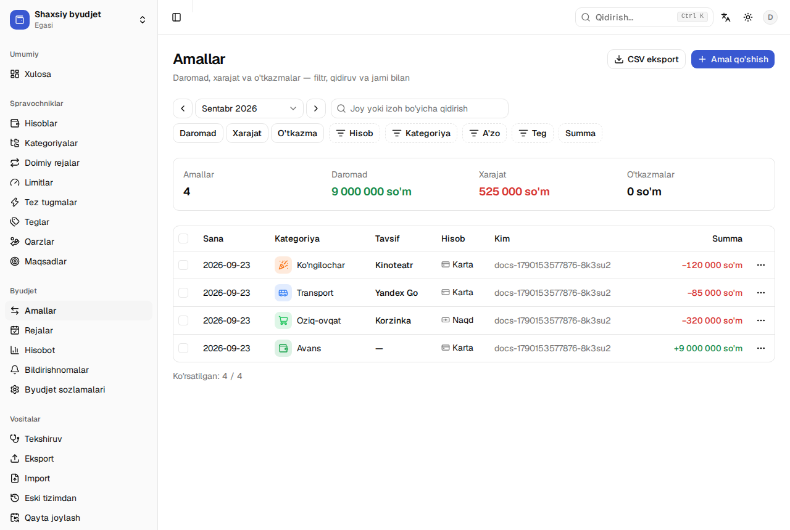
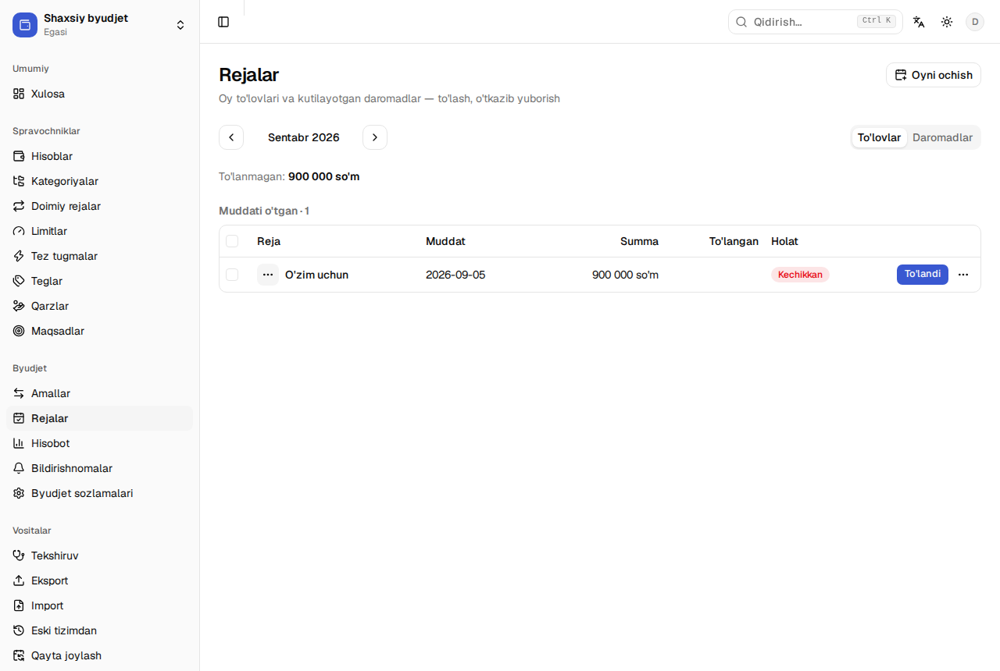
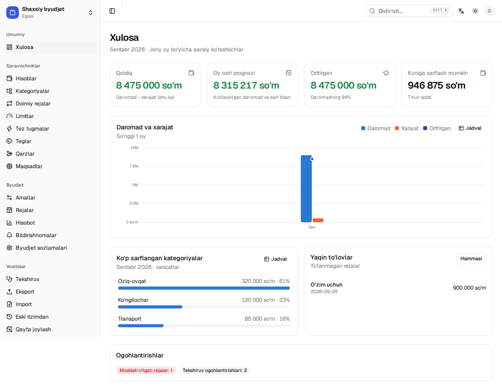
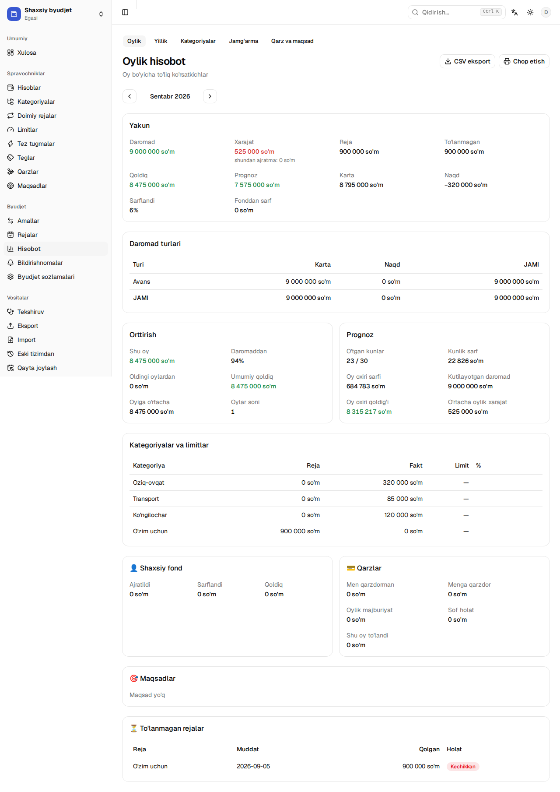
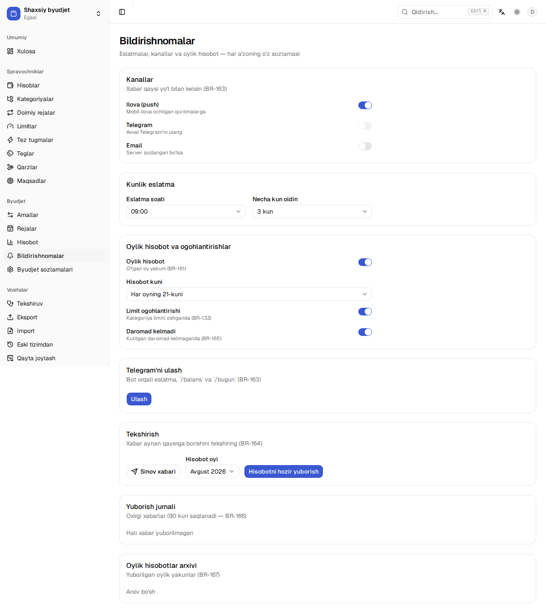
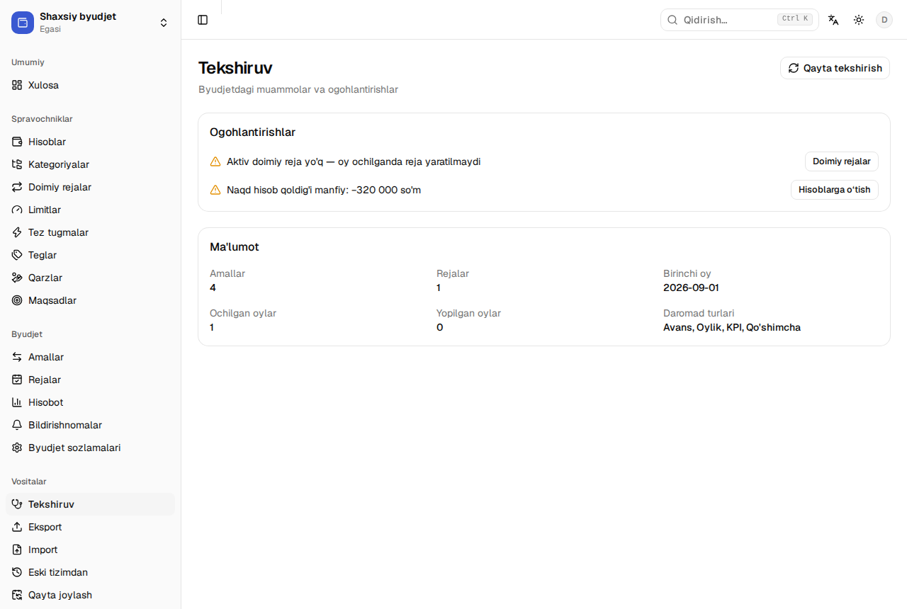

# My Wallet — foydalanuvchi qo'llanmasi

Ikki dastur bir byudjet bilan ishlaydi:

- **Mobil ilova (Android)** — kundalik ish: amal qo'shish, to'lovlar, xulosa.
  Oflayn ishlaydi, tarmoq kelganda o'zi sinxronlanadi.
- **Admin panel (brauzer)** — spravochniklar, hisobotlar, vositalar (import,
  eksport, audit) va byudjet sozlamalari.

Qoidalarning to'liq ta'rifi — [`BIZNES-QOIDALAR.md`](BIZNES-QOIDALAR.md).

## 1. Boshlash

1. Ilovani oching → **Email bilan kirish**: pochtangizga 6 xonali kod keladi
   (Google bilan ham kirish mumkin).
2. Birinchi kirishda **shaxsiy byudjet** avtomatik yaratiladi: hisoblar
   (Naqd, Karta, 👤 Shaxsiy fond), daromad turlari va kategoriyalar tayyor
   holda keladi.
3. **Sozlash ustasi**: hisob qoldiqlari, daromad turlari va doimiy
   xarajatlar (ijara, internet…) kiritiladi. Keyinroq admin panelda
   (**Spravochniklar**) o'zgartirish mumkin.
4. Oilaviy byudjet: admin panel → **Byudjet sozlamalari → A'zolar → Taklif
   yaratish** → 8 belgili kodni bering. Rollar: egasi, admin, a'zo, kuzatuvchi.

## 2. Kundalik ish — amallar

- Mobil ilovada **+** tugmasi: summa, kategoriya, hisob, sana. Tez tugmalar
  (masalan «Kofe») bir bosishda yozadi, 5 soniya ichida **Bekor qilish**
  mumkin.
- Joy nomini yozsangiz — kategoriya va hisob tarixdan taklif qilinadi.
- Chek rasmini biriktirish mumkin (1 MB gacha); oflaynda navbatda turadi.
- Admin panelda: **Amallar** → filtr (davr, tur, hisob, kategoriya, teg),
  qidiruv, ommaviy amallar va CSV eksport.

**Tegishli oy.** Daromad qaysi oyga tegishli ekanini tur belgilaydi:
«Oylik» odatda **oldingi** oyga yoziladi (2-oktabrda kelgan oylik —
sentabrniki). Kerak bo'lsa amal formasida oyni qo'lda tanlash mumkin.

## 3. Oy bilan ishlash

1. **Rejalar** sahifasida oy ochiladi: doimiy rejalardan shu oyning
   to'lovlari yaratiladi (takroriy ochish xavfsiz — nusxa chiqmaydi).
2. To'lov: **To'landi** (summasi noma'lum bo'lsa — summani kiritasiz).
   Qisman to'lov ham mumkin: qolgani keyingi to'lovda ko'rinadi.
3. Kerak bo'lmagan reja — **O'tkazib yuborish**; keyingi oyga ko'chirish ham
   bor.
4. Oy tugagach **oyni yopish** mumkin: yopilgan oyga yozuv qo'shilmaydi
   (sozlamada «qattiq qulf» yoqilgan bo'lsa).

## 4. 👤 Shaxsiy fond

- Har oy byudjetdan fondga ajratma o'tkaziladi (foiz yoki qat'iy summa —
  **Byudjet sozlamalari → 👤 Shaxsiy fond**).
- Fonddan sarflash — alohida amal: u oylik xarajatga kirmaydi, lekin
  «orttirgan» summani kamaytiradi.
- Ajratma hisobotda «O'zim uchun» qatorida ko'rinadi.

## 5. Qarz va maqsadlar

- **Qarzlar**: umumiy summa, oldin to'langani, oylik to'lov. Amalni qarzga
  bog'lasangiz — qoldiq o'zi kamayadi.
- **Maqsadlar**: maqsad summasi, yig'ilgani va oylik badal; prognoz
  «ulgurasizmi» degan savolga javob beradi.

## 6. Hisobotlar

- **Xulosa**: joriy oy qoldig'i, prognoz, orttirgan foiz, kuniga sarflash
  mumkin bo'lgan summa; oxirgi 12 oy grafigi, eng ko'p sarflangan
  kategoriyalar, yaqin to'lovlar va ogohlantirishlar.
- **Oylik hisobot**: yakun, daromad turlari, limitlar, fond, qarz va
  maqsadlar. Har jadvalni CSV qilib olish yoki chop etish mumkin.
- **Yillik**, **Jamg'arma**, **Kategoriya tahlili** — alohida tablarda.
  Yillik sahifa tepasida **Yil xulosasi**: jamlar, oyiga o'rtacha xarajat va
  eng ko'p/eng kam orttirilgan oy.
- **Tahlillar**: oxirgi 3 oy o'rtachasidan sezilarli oshgan kategoriyalar
  (oylik hisobotda ham "Diqqat" bloki), takrorlanuvchi to'lovlar (obunalar —
  oyiga va yiliga qancha), oyning eng katta xarajatlari va hafta kunlari
  kesimi.

## 7. Bildirishnomalar

- **Bildirishnomalar** sahifasi: kanallar (ilova push, Telegram, email),
  kunlik eslatma soati va necha kun oldin, oylik hisobot kuni, limit va
  «daromad kelmadi» ogohlantirishlari.
- **Telegram**: «Ulash» → QR yoki havola → botda **Start**. Shundan keyin
  bot `/balans`, `/bugun`, `/hisobot [oy]` va `/til uz|ru|en` buyruqlariga
  javob beradi.
- **Botdan tez kiritish**: `taksi 20000` — xarajat; `+5 000 000 oylik` —
  daromad (`+` bilan); `kofe 25k` — mingda. Kategoriya va hisob shu nom bilan
  oxirgi amaldan olinadi; javobdagi **✏️ Kategoriya** tugmasi bilan
  o'zgartiriladi, **❌ Bekor** bilan o'chiriladi.
- **Karta xabarnomasi**: bank botidagi xabarni botga **forward** qiling —
  summa, sana va joy xabardan o'qiladi. Xabardagi karta o'z hisobiga tushishi
  uchun **Hisoblar** sahifasida hisobga *karta oxirgi 4 raqamini* yozing.
- **Sinov xabari** har kanal uchun natijani aniq ko'rsatadi: yuborildi yoki
  nega yuborilmadi (qurilma yo'q, kanal o'chiq, server sozlanmagan).

## 8. Vositalar

- **Tekshiruv** — byudjetdagi muammolar (ochilmagan oy, bog'lanmagan qarz
  to'lovi, manfiy naqd…) va har biri yonida tegishli amal.
- **Eksport** — to'liq JSON zaxira (egasi/admin) va CSV jadvallar.
- **Import** — bank ko'chirmasidan CSV: ustunlarni moslashtirasiz,
  tekshiruvda dublikat va xatolar ko'rinadi, keyin yoziladi.
- **Eski tizimdan** — Google Sheets byudjetini ko'chirish
  ([`MIGRATSIYA.md`](MIGRATSIYA.md)).
- **Audit jurnali** — kim, qachon, nimani o'zgartirgani (180 kun).

## 9. Ko'p beriladigan savollar

**«Orttirgan» nima?** Oy qoldig'i + fondga ajratma − fonddan sarflangan:
ya'ni shu oyda haqiqatda qancha pul qolgani.

**Nega oylik sentabrga yozildi?** Daromad turining oy qoidasi shunday
(«Oylik» — oldingi oy). Amal formasida oyni qo'lda o'zgartirish mumkin.

**Yopilgan oyga yozib bo'lmayapti.** Byudjet sozlamalaridagi «qattiq qulf»
yoqilgan. Oyni qayta oching yoki qulfni o'chiring.

**Ma'lumot qayerda saqlanadi?** Supabase (PostgreSQL) — har byudjet o'z
a'zolariga ko'rinadi. Har kecha shifrlangan zaxira olinadi.

**Ilovani o'chirsam?** Ma'lumot serverda qoladi; qayta kirsangiz
qurilmaga yana yuklanadi. Akkauntni butunlay o'chirish — mobil
Sozlamalarda.
